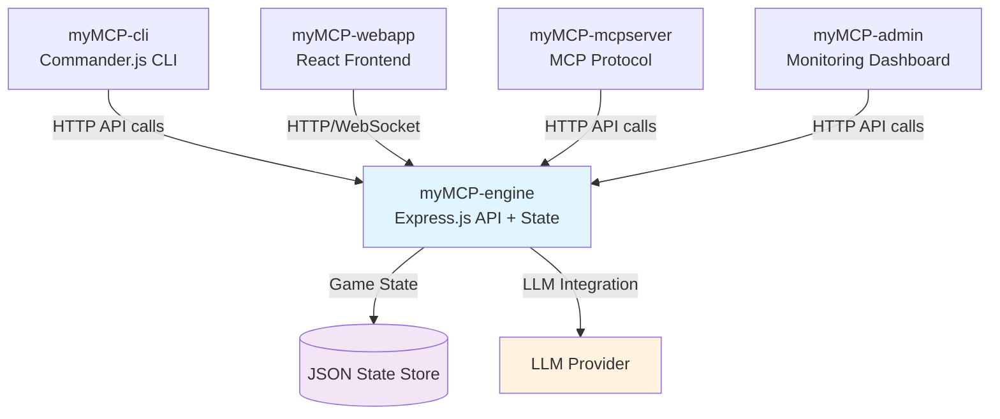

# myMCP Component Dependency Mapping
**Task 1.1 - Component Dependency Analysis**  
**Date**: June 11, 2025  
**Status**: In Progress  

## Overview
This document maps the dependencies between the 5 myMCP components to identify the critical path for our demo delivery.

## Component Architecture



## Dependency Analysis

### Critical Path: ENGINE-FIRST Architecture
**myMCP-engine is the foundational dependency** - all other components depend on it:

1. **Primary Dependencies (Tier 1)**
   - All components → myMCP-engine
   - myMCP-engine → State persistence layer
   - myMCP-engine → LLM integration

2. **Secondary Dependencies (Tier 2)**
   - Tab completion → CLI + Engine integration
   - Quest mechanics → Engine + LLM
   - Web interface → Engine API + Real-time updates
   - Admin dashboard → Engine API + Monitoring endpoints

### Implementation Priority Matrix

| Component | Dependencies | Build Order | Critical Path |
|-----------|-------------|-------------|---------------|
| **myMCP-engine** | None (foundational) | 1st | ✅ CRITICAL |
| **myMCP-cli** | Engine API | 2nd | ✅ CRITICAL |
| **myMCP-webapp** | Engine API | 3rd | High |
| **myMCP-admin** | Engine API | 4th | Medium |
| **myMCP-mcpserver** | Engine API | 5th | Medium |

## Detailed Component Dependencies

### myMCP-engine (Foundation)
**Role**: Central state manager and API provider  
**Dependencies**: 
- Node.js/Express.js runtime
- JSON file persistence (MVP) 
- LLM provider integration
- Game state transition rules

**Provides**:
```
GET /state → Current game state
PUT /state/player → Update player state
POST /transition/start-quest → State transitions
GET /context/completions → Tab completion data
POST /generate/description → LLM narratives
```

### myMCP-cli (Primary Interface)
**Role**: Command-line game interface  
**Dependencies**:
- myMCP-engine API endpoints
- Commander.js framework
- Tab completion engine integration

**Critical for Demo**: ✅ Part of 30-second demo flow

### myMCP-webapp (Secondary Interface) 
**Role**: Web-based game interface  
**Dependencies**:
- myMCP-engine API endpoints
- React frontend framework
- Real-time state synchronization
- Chat interface components

**Critical for Demo**: ✅ Part of 30-second demo flow

### myMCP-admin (Monitoring)
**Role**: System administration and debugging  
**Dependencies**:
- myMCP-engine API endpoints
- Real-time monitoring capabilities
- Log aggregation
- Manual state manipulation tools

**Critical for Demo**: ⚠️ Nice-to-have for impressive technical showcase

### myMCP-mcpserver (Integration)
**Role**: MCP protocol bridge  
**Dependencies**:
- myMCP-engine API endpoints
- MCP protocol implementation
- stdio communication handling
- Protocol translation layer

**Critical for Demo**: ⚠️ Technical innovation showcase, not core demo

## Critical Path Analysis

### Minimum Viable Demo (30 seconds)
**Must Have**:
1. myMCP-engine (state management)
2. myMCP-cli (command interface)
3. myMCP-webapp (web interface)
4. Shared state demonstration

**Can Defer**:
- myMCP-admin (monitoring)
- myMCP-mcpserver (MCP protocol)
- Advanced quest mechanics
- Complex LLM integration

### Risk Assessment

| Risk | Impact | Mitigation |
|------|--------|------------|
| Engine API instability | Demo failure | Build engine first, test thoroughly |
| CLI/Web state sync issues | Demo confusion | Implement simple state, complex features later |
| LLM integration complexity | Development delay | Hard-code responses initially, add LLM after |
| Quest implementation scope | Timeline risk | Implement 1 simple quest, expand later |

## Implementation Sequence

### Phase 1: Core Foundation (Days 1-3)
1. **myMCP-engine**: Basic Express.js API + JSON state
2. **myMCP-cli**: Commander.js with hard-coded responses
3. **Integration Test**: CLI → Engine API calls working

### Phase 2: Demo Capability (Days 4-6)
1. **myMCP-webapp**: Basic React interface
2. **State Synchronization**: CLI ↔ Web shared state
3. **Demo Flow**: 30-second demonstration working

### Phase 3: Enhancement (Days 7+)
1. **LLM Integration**: Dynamic responses
2. **Quest Mechanics**: At least 1 complete quest
3. **Polish**: Tab completion, better UI

### Phase 4: Optional Components (As Time Permits)
1. **myMCP-admin**: Monitoring dashboard
2. **myMCP-mcpserver**: MCP protocol support

## Success Metrics

### MVP Success (Minimum)
- ✅ CLI can set/get game state
- ✅ Web interface shows same state
- ✅ 30-second demo completes successfully

### Full Success (Ideal)
- ✅ All 5 components operational
- ✅ LLM integration working
- ✅ At least 1 complete quest
- ✅ Tab completion functional
- ✅ Admin monitoring available

## Next Steps

1. **Immediate**: Begin myMCP-engine development (Task 4)
2. **Parallel**: Set up Node.js project structure (Task 2)
3. **Validation**: Create simple CLI prototype (Task 3)
4. **Integration**: Connect CLI to Engine (Task 5)

**Timeline Target**: Foundation complete within 1 week for summer demo delivery

---
*This analysis supports our mission to rescue the lunch and learn from enterprise scope creep. Focus on working demo over perfect architecture.*
