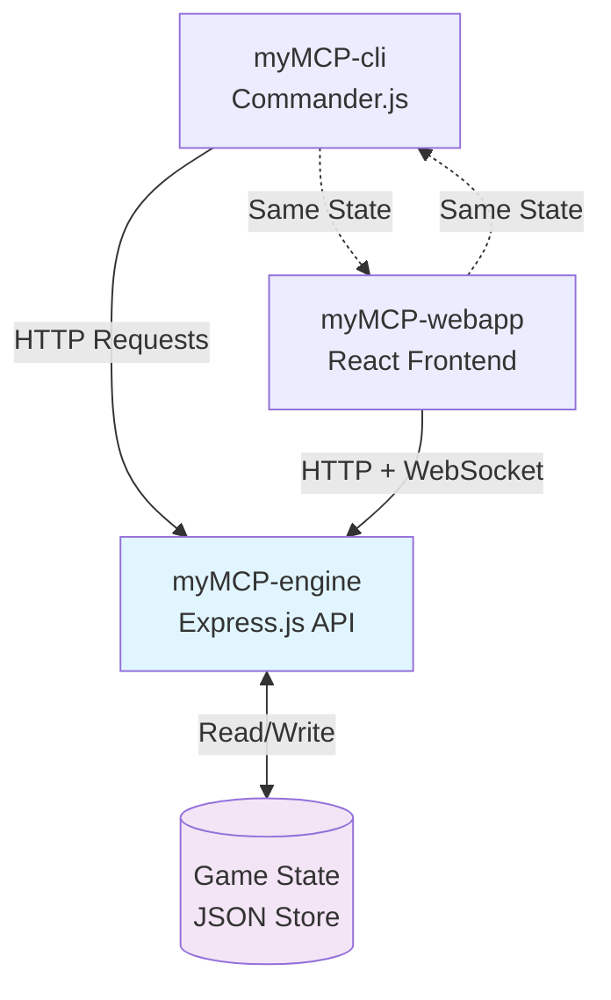

# Interface Compatibility Analysis
**Task 1.3 - CLI/Web Shared State Assessment**  
**Date**: June 11, 2025  
**Status**: In Progress

## Overview
Analysis of shared state implementation requirements to ensure seamless interaction between CLI and web interfaces for our 30-second demo.

## Core Compatibility Requirement

### The Demo Promise
**"Same state, multiple interfaces, real conversation flow"**

Users must be able to:
1. Start interaction on CLI
2. Continue seamlessly on Web
3. Return to CLI without losing context
4. See identical game state across both interfaces

## Technical Architecture for State Sharing

### Centralized State Management


### State Synchronization Strategy

#### 1. Single Source of Truth
**myMCP-engine maintains authoritative game state**:
```typescript
interface GameState {
  player: {
    id: string;
    name: string;
    score: number;
    level: string; // novice, apprentice, expert, master
    location: string;
    status: 'idle' | 'chatting' | 'in-quest' | 'completed-quest';
  };
  
  quests: {
    available: Quest[];
    active: Quest | null;
    completed: Quest[];
  };
  
  inventory: {
    items: Item[];
    capacity: number;
  };
  
  session: {
    startTime: Date;
    lastAction: Date;
    turnCount: number;
  };
}
```

#### 2. API Consistency Contract
**Both interfaces use identical API calls**:
```typescript
// CLI Implementation
const response = await fetch('http://localhost:3000/api/state');
const gameState = await response.json();

// Web Implementation  
const response = await fetch('http://localhost:3000/api/state');
const gameState = await response.json();
```

#### 3. Real-time Synchronization
**Web interface receives live updates**:
```typescript
// WebSocket for real-time updates
const ws = new WebSocket('ws://localhost:3000/ws');
ws.onmessage = (event) => {
  const stateUpdate = JSON.parse(event.data);
  updateGameState(stateUpdate);
};
```

## Interface-Specific Implementations

### CLI Interface Requirements
**Command-Response Pattern**:
```bash
# State queries must return consistent data
./mycli get-score
# Response: "Current score: 100 points"

./mycli get-status  
# Response: "Status: In quest - Council of Three Realms"

./mycli get-inventory
# Response: "Items: Ancient Map, Silver Coin (2/10 slots used)"
```

**State Modification Commands**:
```bash
# Commands that change state
./mycli start-quest "Council of Three Realms"
./mycli complete-action "invite-ally"
./mycli use-item "Ancient Map"
```

### Web Interface Requirements
**Real-time State Display**:
- **Left Panel**: Player stats, inventory, current location
- **Center Chat**: Conversation history and current interaction
- **Right Panel**: Quest progress, available actions

**Synchronized Elements**:
```jsx
// Score display must match CLI exactly
const ScoreDisplay = () => {
  const [score, setScore] = useState(0);
  
  useEffect(() => {
    // Real-time updates via WebSocket
    ws.onmessage = (event) => {
      const { type, data } = JSON.parse(event.data);
      if (type === 'SCORE_UPDATE') {
        setScore(data.score);
      }
    };
  }, []);
  
  return <div>Score: {score} points</div>;
};
```

## Critical Compatibility Scenarios

### Scenario 1: Score Update Demo
**Test Case**: The core 30-second demo flow
```
1. Web: User asks "What's my score?" → Shows 0
2. CLI: User runs `./mycli set-score 100`
3. Web: Score display updates to 100 in real-time
4. Web: User asks "What's my score now?" → Shows 100
```

**Technical Requirements**:
- WebSocket connection for instant updates
- Consistent API response format
- Error handling for connection issues

### Scenario 2: Quest Progression
**Test Case**: Quest state synchronization
```
1. CLI: `./mycli start-quest "Global Meeting"`
2. Web: Quest panel shows "Active: Council of Three Realms"
3. Web: User selects ally from interface
4. CLI: `./mycli get-quest-status` → Shows ally selection
```

**Technical Requirements**:
- Quest state persistence
- UI state management
- Progress tracking consistency

### Scenario 3: Conversation Continuity
**Test Case**: Chat history preservation
```
1. CLI: `./mycli chat "give me a quest"`
2. Web: Chat shows bot response about available quests
3. Web: User continues conversation in chat interface
4. CLI: `./mycli chat "what did we just discuss?"` → References previous conversation
```

**Technical Requirements**:
- Conversation history persistence
- Context preservation across interfaces
- LLM memory consistency

## Implementation Challenges and Solutions

### Challenge 1: State Update Timing
**Problem**: CLI commands complete before web interface updates
**Solution**: 
- CLI waits for API confirmation before showing success
- WebSocket pushes immediate updates to web clients
- Implement optimistic UI updates with rollback

### Challenge 2: Connection Handling
**Problem**: Web interface loses connection, shows stale state
**Solution**:
```typescript
// Connection recovery strategy
const reconnectWebSocket = () => {
  if (ws.readyState === WebSocket.CLOSED) {
    ws = new WebSocket('ws://localhost:3000/ws');
    // Re-sync state after reconnection
    syncGameState();
  }
};
```

### Challenge 3: Command Translation
**Problem**: CLI and Web use different interaction patterns
**Solution**: Unified action system
```typescript
// Both interfaces use same action format
interface GameAction {
  type: 'SET_SCORE' | 'START_QUEST' | 'CHAT' | 'USE_ITEM';
  payload: any;
  timestamp: Date;
}

// CLI translates commands to actions
const setScoreCommand = (score: number) => ({
  type: 'SET_SCORE',
  payload: { score },
  timestamp: new Date()
});

// Web translates UI events to actions
const handleScoreInput = (score: number) => {
  dispatchAction({
    type: 'SET_SCORE',
    payload: { score },
    timestamp: new Date()
  });
};
```

## Testing Strategy

### Compatibility Test Suite
1. **State Consistency Tests**
   - Verify identical API responses across interfaces
   - Check real-time synchronization accuracy
   - Validate state persistence across sessions

2. **Demo Flow Tests**
   - Automate 30-second demo scenario
   - Test all CLI → Web → CLI transitions
   - Verify conversation continuity

3. **Error Handling Tests**
   - Network disconnection recovery
   - API failure graceful degradation
   - State corruption prevention

### Performance Requirements
- **CLI Response Time**: < 200ms for all commands
- **Web Update Latency**: < 100ms for state changes
- **WebSocket Reconnection**: < 2 seconds

## Risk Assessment

### High-Risk Compatibility Issues
1. **Race Conditions**: CLI and Web modifying state simultaneously
2. **Network Latency**: Web updates lagging behind CLI commands
3. **State Corruption**: Inconsistent data between interfaces

### Mitigation Strategies
1. **Optimistic Locking**: Prevent concurrent state modifications
2. **State Versioning**: Track state changes with version numbers
3. **Validation**: Server-side state validation before persistence

## Implementation Roadmap

### Phase 1: Basic State Sharing
- Implement centralized game state API
- Create simple CLI state commands
- Build basic web state display

### Phase 2: Real-time Synchronization
- Add WebSocket support to engine
- Implement web real-time updates
- Test basic demo flow

### Phase 3: Advanced Features
- Add conversation history persistence
- Implement quest state synchronization
- Build comprehensive error handling

## Success Criteria

### Minimum Viable Compatibility
- ✅ Score updates work across interfaces
- ✅ Basic state queries consistent
- ✅ 30-second demo completes successfully

### Full Compatibility Achievement
- ✅ Real-time synchronization working
- ✅ Quest progression shared correctly
- ✅ Conversation history preserved
- ✅ Error recovery functional
- ✅ Performance targets met

## Technical Specifications

### API Endpoints for Compatibility
```
GET /api/state → Complete game state
PUT /api/state/player → Update player state
POST /api/actions → Execute game action
GET /api/history → Conversation history
WebSocket /ws → Real-time updates
```

### State Update Protocol
```typescript
// State update message format
interface StateUpdate {
  type: 'FULL_STATE' | 'PARTIAL_UPDATE';
  timestamp: Date;
  version: number;
  data: Partial<GameState>;
}
```

This analysis ensures our CLI and Web interfaces will provide the seamless, synchronized experience required for our impressive demo showcase.

---
*Interface compatibility is critical for our demo success. Shared state proves technical competence and delivers on our "same state, multiple interfaces" promise.*
