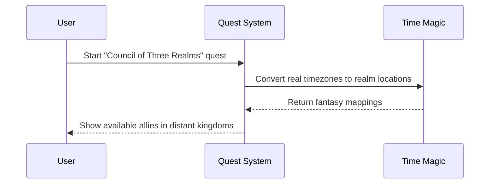

# Chapter 1: Quest System

Have you ever wished your boring work tasks could feel more like an epic adventure? That's exactly what the Quest System in myMCP does! Let's learn how it transforms regular technical tasks into exciting fantasy quests.

## The Problem We're Solving

Imagine you need to schedule a meeting across different time zones - pretty boring, right? But what if instead, you were summoning allies from distant magical kingdoms for an urgent council to save the realm? Much more exciting! This is what the Quest System does.

Let's see how it works with a simple example:



## Key Concepts

### 1. Quest Transform
Each real task gets a fantasy wrapper. Here's a simple example:

```typescript
const realTask = {
  type: "schedule_meeting",
  timezone: "GMT-8"
};

const fantasyQuest = {
  title: "Summon the Western Kingdom's Champion",
  realm: "Lands of the Setting Sun" // GMT-8
};
```

This transforms boring technical details into exciting story elements!

### 2. Skill Mapping
Every quest teaches real skills while maintaining the fantasy narrative:

```typescript
const questSkillMap = {
  skillToLearn: "timezone coordination",
  fantasyDescription: "mastering cross-realm portal magic",
  completionCriteria: "schedule meeting time that works for all"
};
```

## Using the Quest System

Let's create a simple quest. First, we define our quest structure:

```typescript
const simpleQuest = {
  id: "council-of-three",
  title: "Council of Three Realms",
  steps: ["find_allies", "send_invites", "confirm_council"]
};
```

Then we can start the quest through either the CLI or web interface:

```bash
myMCP quest start council-of-three
```

## How It Works Inside

When you start a quest, here's what happens:

1. The system loads the real task requirements
2. It transforms technical elements into fantasy equivalents
3. Progress is tracked through both real and fantasy metrics
4. Completion validates both the actual task and quest objectives

The Quest System works closely with the [Multi-Interface Architecture](02_multi_interface_architecture_.md) to provide both CLI and web interfaces, and the [Game Engine](03_game_engine_.md) for managing game state.

## Implementation Example

Here's a simple quest implementation:

```typescript
class QuestManager {
  transformTask(realTask) {
    return {
      ...realTask,
      fantasyWrapper: this.getFantasyNarrative(realTask.type)
    };
  }
}
```

This basic code shows how regular tasks get their fantasy makeover. The actual implementation includes more sophisticated narrative generation and progress tracking.

## Conclusion

The Quest System makes technical tasks more engaging by wrapping them in fantasy narratives while ensuring real skills are learned. It's the foundation of making work feel like an adventure!

Next up, we'll explore how to interact with these quests through different interfaces in the [Multi-Interface Architecture](02_multi_interface_architecture_.md) chapter.

---

Generated by [AI Codebase Knowledge Builder](https://github.com/The-Pocket/Tutorial-Codebase-Knowledge)