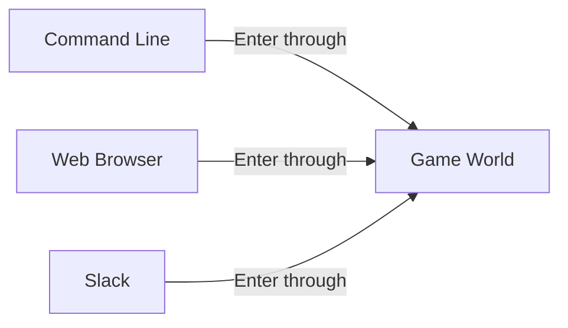
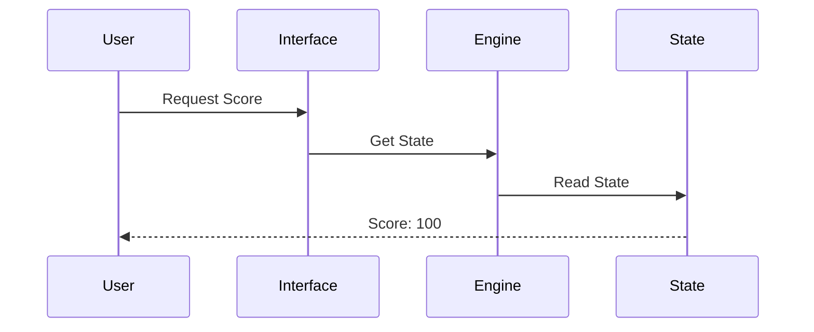

# Chapter 2: Multi-Interface Architecture

Remember how in [Quest System](01_quest_system_.md) we learned to transform boring tasks into exciting quests? Now let's explore how to access these quests from different places - whether you're using the command line, a web browser, or even Slack!

## The Problem: Same Game, Different Doors 🚪

Imagine you're playing a video game at home on your computer. Later, you want to continue playing on your phone while commuting. You expect to see the same game progress, right? That's exactly what Multi-Interface Architecture solves!

Let's see a simple example:



## Key Concepts

### 1. Shared Game State
Think of the game state as a magical book that records everything about your adventure:

```typescript
const gameState = {
  player: {
    score: 100,
    currentQuest: "Council of Three Realms",
    location: "Western Kingdom"
  }
}
```

No matter how you access the game, you're reading from the same magical book!

### 2. Interface Adapters
Each way of playing (CLI, Web, Slack) has its own "translator" that speaks its language:

```typescript
// CLI adapter example
async function handleCliCommand(command) {
  if (command === "status") {
    const state = await getGameState();
    console.log(`Score: ${state.player.score}`);
  }
}
```

## Using Multiple Interfaces

Here's how you might check your score through different interfaces:

```bash
# Via CLI
npm run dev:cli status
> Player Level: apprentice | Score: 100

# Via Web (React component)
<ScoreDisplay />  // Shows: "Score: 100"

# Via Slack
/mymcp status     // Shows: "Score: 100"
```

## How It Works Inside

When you interact with any interface, here's what happens:



Let's see a simple implementation:

```typescript
class GameInterface {
  async getScore() {
    const response = await fetch('http://localhost:3000/api/state/player-id');
    const state = await response.json();
    return state.player.score;
  }
}
```

This code connects to our central [Game Engine](03_game_engine_.md) to ensure everyone sees the same information.

## Conclusion

The Multi-Interface Architecture lets you seamlessly switch between different ways of playing while maintaining your progress. Whether you prefer typing commands, clicking buttons, or chatting in Slack, you're always in the same game world!

Next, we'll explore how the [Game Engine](03_game_engine_.md) manages all this behind the scenes.

---

Generated by [AI Codebase Knowledge Builder](https://github.com/The-Pocket/Tutorial-Codebase-Knowledge)