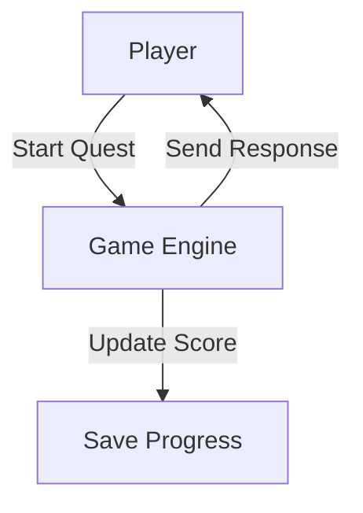
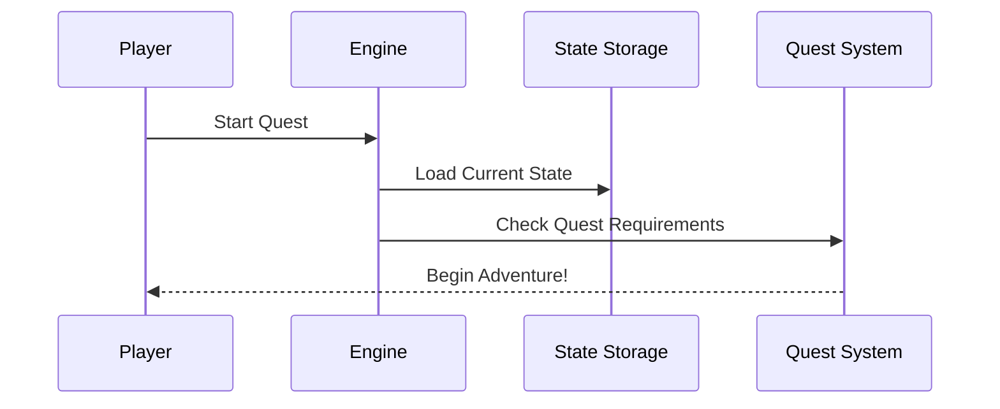

# Chapter 3: Game Engine

Remember how in the [Multi-Interface Architecture](02_multi_interface_architecture_.md) we learned about different ways to access our game? Now let's explore the brain that powers it all - the Game Engine!

## The Problem: Who Keeps Track of Everything? 🎮

Imagine you're playing Dungeons & Dragons, and your friend is the Dungeon Master (DM). The DM keeps track of everyone's health, items, and progress. Our Game Engine is just like that DM - it remembers everything about your game!

Let's see a simple example:



## Key Concepts

### 1. Game State
Think of game state like your character sheet in D&D:

```typescript
const playerState = {
  score: 100,
  currentQuest: "Council of Three",
  items: ["Magic Wand", "Health Potion"]
};
```

This keeps track of everything about your adventure!

### 2. REST API
The Game Engine talks to other parts through simple commands:

```typescript
// Getting player score
app.get('/api/state', (req, res) => {
  res.json({ score: playerState.score });
});
```

This lets any part of the system check your progress!

## Using the Game Engine

Here's how to interact with the engine:

```typescript
// Start a new quest
async function startQuest(questId, playerId) {
  const response = await fetch(`http://localhost:3000/api/actions/${playerId}`, {
    method: 'POST',
    headers: { 'Content-Type': 'application/json' },
    body: JSON.stringify({ 
      type: 'START_QUEST', 
      payload: { questId },
      playerId 
    })
  });
}
```

This code tells the engine you want to begin a new adventure!

## How It Works Inside

When you do something in the game, here's what happens:



Let's see a simple implementation:

```typescript
class GameEngine {
  processAction(action) {
    const state = this.loadState();
    const newState = this.updateState(state, action);
    this.saveState(newState);
    return newState;
  }
}
```

This shows how the engine handles each player action, updating and saving their progress.

## Advanced Features

The engine also manages:
- [Quest System](01_quest_system_.md) progress
- [MCP Integration](04_mcp__model_context_protocol__integration_.md) for smart responses
- [Multiplayer Coordination](05_multiplayer_coordination_.md) between players

## Conclusion

The Game Engine is like a friendly DM who keeps track of everything in your adventure! It works with the [MCP Integration](04_mcp__model_context_protocol__integration_.md) to make the game even smarter, which we'll learn about next.

---

Generated by [AI Codebase Knowledge Builder](https://github.com/The-Pocket/Tutorial-Codebase-Knowledge)