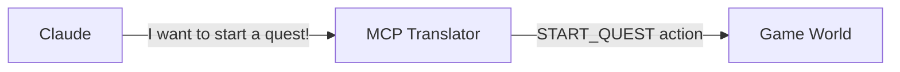
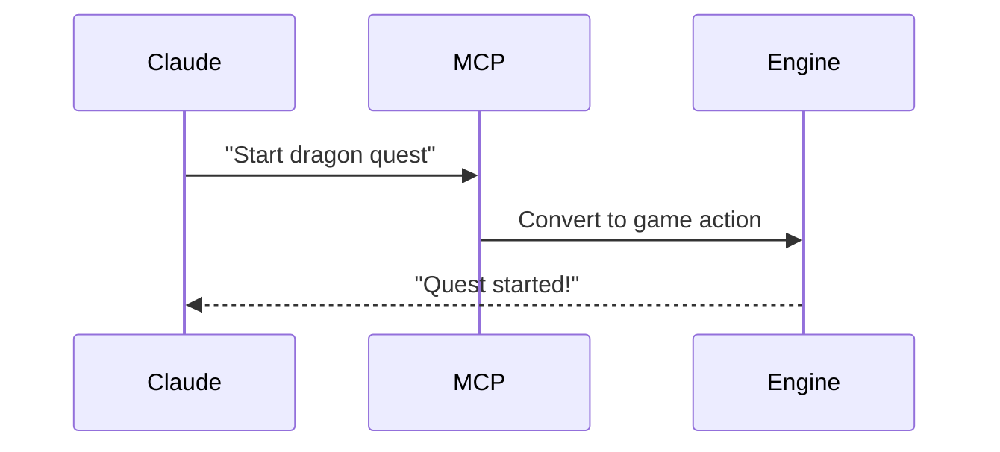

# Chapter 4: MCP (Model Context Protocol) Integration

Remember how in [Game Engine](03_game_engine_.md) we learned about the brain of our game? Now let's explore how we make our AI friend Claude understand and interact with that game world!

## The Problem: Speaking Different Languages 🗣️

Imagine you're trying to talk to someone who speaks a different language. You need a translator, right? MCP is like that translator between Claude (our AI friend) and our game world. Let's see a simple example!



## Key Concepts

### 1. Resources
Think of resources like a menu in a restaurant - they tell Claude what information is available:

```typescript
const gameResources = {
  playerProfile: "mcp://game/player/123",
  quests: "mcp://game/quests/123"
};
```

This shows Claude where to find different types of information!

### 2. Tools
Tools are like special commands Claude can use to do things in the game:

```typescript
function startQuest(questId) {
  return mcpServer.execute('start_quest', {
    questId: questId
  });
}
```

This lets Claude start new quests for players!

## Using MCP

Here's how Claude might interact with our game:

```typescript
// Claude checking player info
const playerInfo = await getResource('mcp://game/player/123');
// Claude starting a quest
await executeTool('start_quest', { questId: 'dragon-quest' });
```

This code shows how Claude can get information and take actions in our game world!

## How It Works Inside

When Claude wants to do something in the game, here's what happens:



Let's see a simple implementation:

```typescript
class MCPTranslator {
  async translate(claudeRequest) {
    const gameAction = this.convertToGameFormat(claudeRequest);
    return await this.gameEngine.execute(gameAction);
  }
}
```

This shows how MCP converts Claude's requests into something our [Game Engine](03_game_engine_.md) can understand!

## Working with Multiple Systems

MCP helps connect different parts of our game:
- Works with the [Quest System](01_quest_system_.md) for adventures
- Connects to the [Multi-Interface Architecture](02_multi_interface_architecture_.md)
- Enables [Multiplayer Coordination](05_multiplayer_coordination_.md)

## Conclusion

MCP is like a universal translator that helps Claude talk to our game world! It converts AI language into game actions and back, making everything work smoothly together.

Next up, we'll learn how to handle multiple players playing together in [Multiplayer Coordination](05_multiplayer_coordination_.md)!

---

Generated by [AI Codebase Knowledge Builder](https://github.com/The-Pocket/Tutorial-Codebase-Knowledge)