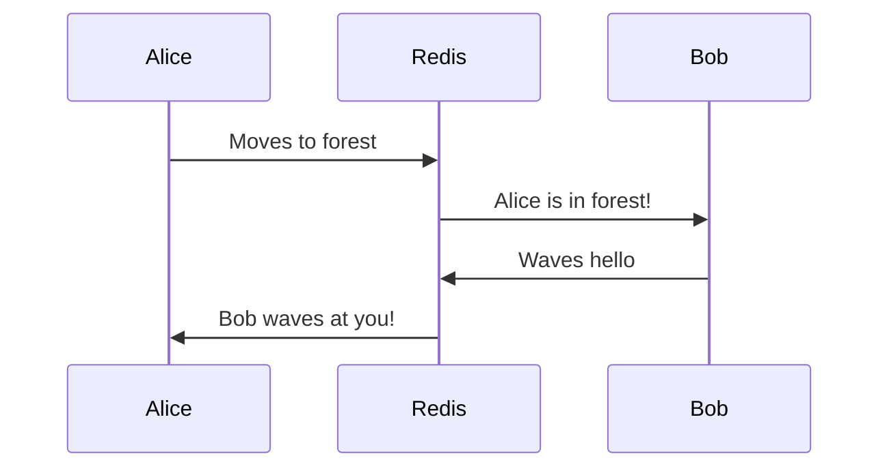
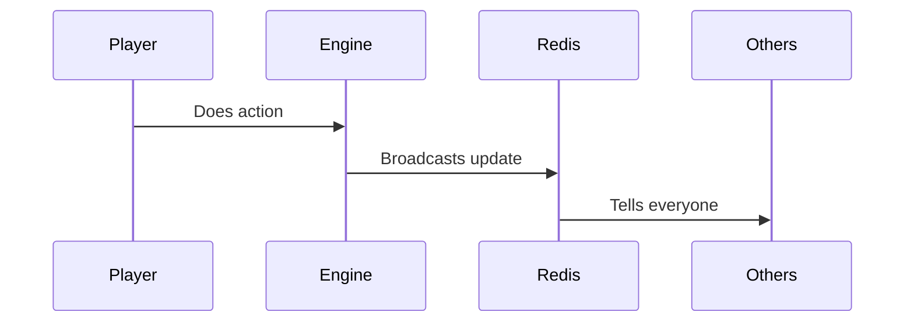

# Chapter 5: Multiplayer Coordination

Remember how in [MCP Integration](04_mcp__model_context_protocol__integration_.md) we learned about talking to our AI friend Claude? Now let's explore how to make multiple players work together in real-time - like magic mirrors that show the same reflection everywhere! 🪞

## The Problem: Everyone Seeing the Same Thing 👥

Imagine you and your friends are playing with toy blocks. If you move a block, everyone should see it move at the same time! That's what Multiplayer Coordination does - it makes sure everyone sees the same game world.

Let's see a simple example:



## Key Concepts

### 1. Real-Time Events
Think of events like text messages - they're how players tell each other what they're doing:

```typescript
const gameEvent = {
  type: 'PLAYER_MOVED',
  player: 'Alice',
  location: 'forest'
};
```

When Alice moves, everyone gets this message right away!

### 2. Shared State
Like a shared scoreboard that everyone can see:

```typescript
const worldState = {
  players: {
    alice: { location: 'forest' },
    bob: { location: 'castle' }
  }
};
```

## Using Multiplayer Features

Here's how to interact with other players:

```typescript
// Send a message to everyone
chat.sendGlobal("Hello everyone!");

// Move to a new location
player.moveTo('forest');
```

This code helps players talk and move around together!

## How It Works Inside

When a player does something, here's what happens:



Let's see a simple implementation:

```typescript
class MultiplayerService {
  publishUpdate(event) {
    this.redis.publish('game:events', {
      type: event.type,
      data: event.data
    });
  }
}
```

This shows how we tell everyone about changes using Redis!

## Cool Features

1. **Global Chat** - Talk to everyone
2. **Location Updates** - See where friends are
3. **Quest Progress** - Watch friends complete quests
4. **Team Activities** - Work together on challenges

## Working with Other Systems

Multiplayer Coordination works with:
- [Quest System](01_quest_system_.md) for group quests
- [Game Engine](03_game_engine_.md) for processing actions
- [Admin Dashboard](06_admin_dashboard_.md) for monitoring

## Conclusion

Multiplayer Coordination is like having magical mirrors that show everyone the same game world! When one player does something, everyone sees it happen instantly.

Next up, we'll learn how to watch over all these players with the [Admin Dashboard](06_admin_dashboard_.md)!

---

Generated by [AI Codebase Knowledge Builder](https://github.com/The-Pocket/Tutorial-Codebase-Knowledge)