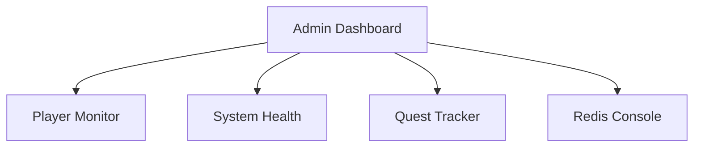
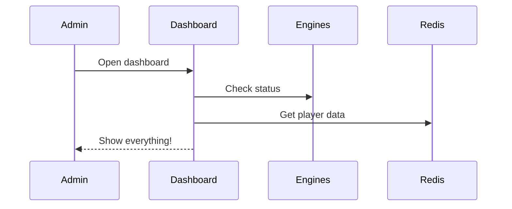

# Chapter 6: Admin Dashboard

Remember how in [Multiplayer Coordination](05_multiplayer_coordination_.md) we learned about players working together? Now let's explore how to watch over everything happening in our game world - like having a magical control room! 🎮

## The Problem: Keeping an Eye on Everything 👀

Imagine you're hosting a big party. You need to make sure there's enough food, everyone's having fun, and nothing's broken. That's exactly what the Admin Dashboard does for our game! Let's see a simple example:



## Key Concepts

### 1. Health Monitoring
Like a doctor checking vital signs:

```typescript
const systemHealth = {
  engines: "All running! 🟢",
  memory: "50% used",
  players: "20 active"
};
```

This tells us if everything's working well!

### 2. Player Management
Keep track of everyone playing:

```typescript
const playerStats = {
  active: 20,
  topScore: "Alice: 1000",
  questProgress: "5 ongoing"
};
```

## Using the Dashboard

Here's how to check on things:

```typescript
// Check system health
dashboard.getHealth();

// Find a player
dashboard.findPlayer('alice');

// Watch live events
dashboard.subscribeToEvents();
```

## How It Works Inside

When an admin checks the dashboard:



Let's see a simple implementation:

```typescript
class AdminDashboard {
  async getOverview() {
    const health = await this.checkHealth();
    const players = await this.getActivePlayers();
    return { health, players };
  }
}
```

This code collects all the important information for admins to see!

## Cool Features

1. **Live Updates** - See changes as they happen
2. **Player Search** - Find anyone quickly
3. **Quest Progress** - Track everyone's adventures
4. **System Health** - Make sure everything's working

## Working with Other Parts

The Admin Dashboard works with:
- [Quest System](01_quest_system_.md) to track adventures
- [Game Engine](03_game_engine_.md) to monitor performance
- [MCP Integration](04_mcp__model_context_protocol__integration_.md) for AI interactions

## Conclusion

The Admin Dashboard is like having a magical control room where you can watch over everything happening in your game world! It helps keep everything running smoothly and everyone having fun.

Next up, we'll learn how to make sure everything works correctly with the [Testing Framework](07_testing_framework_.md)!

---

Generated by [AI Codebase Knowledge Builder](https://github.com/The-Pocket/Tutorial-Codebase-Knowledge)