# Chapter 7: Testing Framework

Remember how in [Admin Dashboard](06_admin_dashboard_.md) we learned to watch over our game world? Now let's learn how to make sure everything works correctly - like having a team of expert game testers! 🎮

## The Problem: Making Sure Everything Works! 🧪

Imagine you're building a huge LEGO castle. Before showing it to your friends, you want to check if all parts fit together perfectly. That's what our Testing Framework does - it checks if every part of our game works correctly! Let's see a simple example:

```mermaid
graph TD
    A[Run Tests] --> B[Check Player]
    A --> C[Check Quests]
    A --> D[Check Chat]
    B --> E[All Good! ✅]
    C --> E
    D --> E
```



## Key Concepts

### 1. Unit Tests
Like checking each LEGO piece individually:

```typescript
test('player should level up', () => {
  const player = createPlayer();
  player.addScore(150);  // Apprentice level starts at 100 points
  expect(player.level).toBe('apprentice');
});
```

This makes sure each small part works perfectly!

### 2. Integration Tests
Like making sure LEGO pieces fit together:

```typescript
test('complete quest flow', async () => {
  const playerId = 'test-player';
  await startQuest('global-meeting', playerId);
  await completeQuest(playerId);
  const state = await getPlayerState(playerId);
  expect(state.player.score).toBeGreaterThan(0);
});
```

## Using the Testing Framework

Here's how to run tests:

```bash
# Run all tests
npm test

# Run API integration tests
cd tests/api && npm test

# Run specific engine tests
npm run test --workspace=packages/engine
```

This helps us find and fix problems before players see them!

## How It Works Inside

When we run tests, here's what happens:


Let's see a simple implementation:

```typescript
class TestRunner {
  async runTests() {
    const results = [];
    for (const test of this.tests) {
      const result = await test.run();
      results.push(result);
    }
    return results;
  }
}
```

This code shows how we run all our tests one by one!

## Working with Other Parts

The Testing Framework works with:
- [Quest System](01_quest_system_.md) to test adventures
- [Game Engine](03_game_engine_.md) to check game rules
- [MCP Integration](04_mcp__model_context_protocol__integration_.md) to test AI responses

## Cool Features

1. **Auto-Testing** - Tests run automatically when we make changes
2. **Clear Reports** - Easy to understand test results
3. **Quick Fixes** - Helps find problems fast
4. **Safe Updates** - Makes sure new changes don't break old features

## Conclusion

The Testing Framework is like having a team of expert game testers making sure everything works perfectly! It helps us catch problems early and keep our game running smoothly.

This was the final chapter! We've learned everything about making our game work reliably and efficiently. Time to put it all together and create amazing adventures! 🎮✨

---

Generated by [AI Codebase Knowledge Builder](https://github.com/The-Pocket/Tutorial-Codebase-Knowledge)