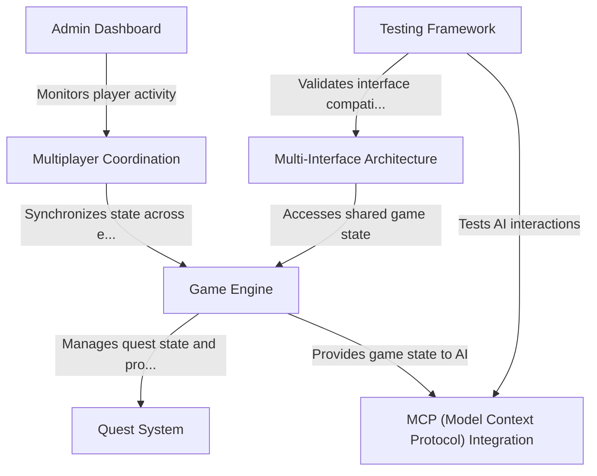

# Tutorial: myMCP

myMCP is a **fantasy-themed technical training platform** that transforms real-world technical tasks into engaging quest-based adventures. It uses an *AI-powered game engine* to turn mundane activities like meeting scheduling into epic quests like "Council of Three Realms". The system supports **multiple interfaces** (CLI, Web, Slack) and enables teams to learn technical skills through an immersive multiplayer experience with real-time coordination.

**Source Repository:** [https://github.com/jcaldwell1066/myMCP](https://github.com/jcaldwell1066/myMCP)

## Chapters

1. [Quest System
](01_quest_system_.md)
2. [Multi-Interface Architecture
](02_multi_interface_architecture_.md)
3. [Game Engine
](03_game_engine_.md)
4. [MCP (Model Context Protocol) Integration
](04_mcp__model_context_protocol__integration_.md)
5. [Multiplayer Coordination
](05_multiplayer_coordination_.md)
6. [Admin Dashboard
](06_admin_dashboard_.md)
7. [Testing Framework
](07_testing_framework_.md)

---

Generated by [AI Codebase Knowledge Builder](https://github.com/The-Pocket/Tutorial-Codebase-Knowledge)