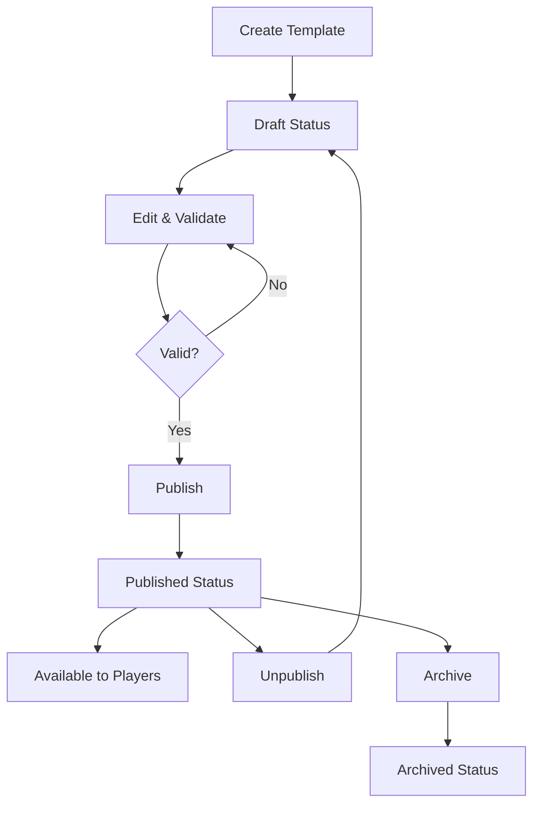

# myMCP Admin Dashboard - Quest Editor

A comprehensive admin dashboard and quest editor for the myMCP system, featuring:

- **Quest Template Management** - List, create, edit, and publish quest templates
- **Enhanced Quest Step Editor** - Full support for the enhanced quest step object model
- **Draft/Publish Workflow** - Save templates as drafts and publish when ready
- **JSON Editor** - Advanced raw JSON editing capabilities
- **Real-time Updates** - WebSocket-based real-time synchronization
- **Template Validation** - Comprehensive validation before publishing

## 🏗️ Architecture

```
myMCP Admin Dashboard
├── packages/admin/
│   ├── src/                    # Express server (Node.js + TypeScript)
│   │   └── index.ts           # API proxy and WebSocket server
│   └── client/                # React frontend (TypeScript + Tailwind)
│       ├── src/
│       │   ├── pages/
│       │   │   ├── QuestTemplateList.tsx      # Template list view
│       │   │   ├── QuestTemplateEditor.tsx    # Form + JSON editor
│       │   │   ├── Dashboard.tsx              # Admin overview
│       │   │   └── ...
│       │   └── components/
│       │       └── Layout.tsx                 # Navigation + layout
│       └── package.json
└── Engine Integration
    ├── Enhanced API endpoints
    ├── Quest template storage
    └── Validation services
```

## 🚀 Quick Start

### Prerequisites

- Node.js 18+ 
- npm 8+
- myMCP Engine running on port 3001

### Installation

1. **Install admin dashboard dependencies:**
   ```bash
   cd packages/admin
   npm run setup  # Installs both server + client dependencies
   ```

2. **Install additional engine dependencies:**
   ```bash
   cd packages/engine
   npm install uuid @types/node
   ```

3. **Start the admin dashboard:**
   ```bash
   cd packages/admin
   npm run dev
   ```

   This starts:
   - **Server** on `http://localhost:3003` (API proxy + WebSocket)
   - **Client** on `http://localhost:3000` (React development server)

4. **Start the engine** (in separate terminal):
   ```bash
   cd packages/engine
   npm run dev
   ```

### Access the Dashboard

- **Admin Dashboard:** http://localhost:3000
- **API Documentation:** http://localhost:3003/health
- **Engine API:** http://localhost:3001/health

## 📋 Features Overview

### Quest Template List (`/quests/templates`)

**✅ Complete Implementation** with all requested features:

- **List View** - Paginated table showing all quest templates
- **Status Filtering** - Filter by draft/published/archived status
- **Category Filtering** - Filter by business/coordination/development/etc
- **Search** - Real-time search across names, descriptions, and tags
- **Inline Actions:**
  - ✏️ Edit template
  - 📄 Duplicate template  
  - ✅ Publish/Unpublish
  - 🗑️ Delete (archives published templates)

### Quest Template Editor (`/quests/templates/:id`)

**✅ Complete Implementation** with dual-mode editing:

#### **Form Mode** - User-friendly interface for:
- **Top-level Attributes:**
  - Template name, description, category
  - Tags (comma-separated input)
  - Version and status management

- **Quest Definition:**
  - Title, difficulty, real-world skill mapping
  - Fantasy theme, estimated duration
  - Description and narrative elements

- **Enhanced Quest Steps:**
  - Add/remove steps dynamically
  - Step titles, descriptions, points
  - Rich metadata (difficulty, category, tags)
  - Execution types (manual/automated/hybrid)
  - Validation criteria and resources

#### **JSON Mode** - Advanced editing:
- **Full JSON Editor** powered by JSONEditor React component
- **Syntax highlighting** and validation
- **Search and replace** within JSON
- **History/undo** functionality
- **Real-time validation** before saving

### Draft/Publish Workflow

**✅ Complete Implementation:**

- **Save as Draft** - Work in progress, not visible to players
- **Publish** - Make available in quest catalog for all players
- **Unpublish** - Return published template to draft status
- **Version Control** - Automatic version incrementing on publish
- **Validation Gates** - Templates must pass validation to publish

### Enhanced Quest Step Support

**✅ Full Integration** with the enhanced quest step object model:

```typescript
interface EnhancedQuestStep {
  // Basic properties (legacy compatible)
  id: string;
  title: string;
  description: string;
  completed: boolean;
  
  // Enhanced metadata
  metadata: {
    difficulty: 'easy' | 'medium' | 'hard';
    category: 'development' | 'coordination' | 'research' | ...;
    tags: string[];
    points: number;
    estimatedDuration?: string;
    prerequisites?: string[];
    realWorldSkill?: string;
  };
  
  // Learning resources
  resources: {
    docs?: Array<{ title, url, type, description }>;
    tools?: Array<{ name, url, type, description }>;
    examples?: Array<{ name, type, description }>;
  };
  
  // Execution configuration
  execution: {
    type: 'manual' | 'automated' | 'hybrid';
    validation: {
      type: 'checklist' | 'test' | 'output' | 'criteria';
      criteria: string[];
    };
    hints?: string[];
  };
  
  // Progress tracking
  progress: {
    attempts: number;
    notes: string[];
    artifacts: string[];
  };
}
```

## 🔧 API Endpoints

### Quest Template Management

```http
# List templates with filtering and pagination
GET /api/admin/quest-templates?status=draft&category=business&page=1&limit=10

# Get single template
GET /api/admin/quest-templates/:id

# Create new template
POST /api/admin/quest-templates
Content-Type: application/json
{
  "name": "Template Name",
  "description": "Template description",
  "category": "business",
  "tags": ["ecommerce", "hospitality"],
  "questDefinition": { /* quest object */ }
}

# Update template
PUT /api/admin/quest-templates/:id
Content-Type: application/json
{ /* updated template data */ }

# Publish template
POST /api/admin/quest-templates/:id/publish

# Unpublish template  
POST /api/admin/quest-templates/:id/unpublish

# Delete template
DELETE /api/admin/quest-templates/:id

# Duplicate template
POST /api/admin/quest-templates/:id/duplicate
Content-Type: application/json
{ "name": "Copy of Original Template" }

# Admin dashboard metrics
GET /api/admin/dashboard
```

### Template Storage

Templates are stored as JSON files in `./quest-templates/` directory:

```
quest-templates/
├── lodge-ecommerce.json           # Alpine Retreat template
├── global-meeting-quest.json      # Council of Three Realms
├── draft-quest-template.json      # Server Monitoring (draft)
└── ...
```

## 🎯 Usage Examples

### Creating a New Quest Template

1. **Navigate to Quest Templates:** `/quests/templates`
2. **Click "New Template"** button
3. **Fill in basic information:**
   - Name: "Customer Support Training"
   - Category: "coordination"
   - Description: "Learn effective customer support techniques"

4. **Define the quest:**
   - Title: "The Merchant's Dilemma"
   - Real-World Skill: "Customer Service Excellence"
   - Fantasy Theme: "Helping troubled merchants in the marketplace"
   - Difficulty: "medium"

5. **Add quest steps:**
   - Step 1: "Learn Active Listening" (25 points)
   - Step 2: "Practice Empathy Responses" (30 points)
   - Step 3: "Handle Difficult Situations" (45 points)

6. **Save as draft** → **Validate** → **Publish**

### Editing Existing Templates

1. **From template list:** Click ✏️ edit icon
2. **Choose editing mode:**
   - **Form Mode:** User-friendly interface for common edits
   - **JSON Mode:** Advanced editing for complex modifications

3. **Make changes:** Template auto-saves indicate unsaved changes
4. **Validate and publish:** Ensure template meets quality standards

### Managing Template Lifecycle



## 🔌 Integration with Existing System

### Engine Integration

The quest editor integrates seamlessly with the existing myMCP engine:

1. **Backward Compatibility:** Enhanced templates work with legacy quest system
2. **API Extensions:** New endpoints extend existing `/api/quests` functionality  
3. **Real-time Updates:** Published templates immediately available to players
4. **Validation:** Templates validated against enhanced quest step schema

### Player Experience

When templates are published, they become available through existing player interfaces:

```bash
# CLI - Players see new quests
mycli quests
> 📋 Available Quests:
>    1. Alpine Retreat E-Commerce Setup (lodge-ecommerce)
>    2. Council of Three Realms (global-meeting-quest)

# Engine API - Quest catalog updated
GET /api/quest-catalog
```

### MCP Server Integration

Published quest templates can be distributed through MCP servers:

```javascript
// MCP server can fetch published templates
const templates = await questTemplateService.getPublishedTemplates();

// Convert to MCP resources
const mcpResources = templates.map(template => ({
  uri: `quest://templates/${template.id}`,
  name: template.name,
  description: template.description,
  mimeType: 'application/json'
}));
```

## 🚦 Development Workflow

### Adding New Features

1. **Backend:** Add API endpoints in `packages/engine/src/index.ts`
2. **Frontend:** Create React components in `packages/admin/client/src/`
3. **Types:** Update shared types in `shared/types/src/index.ts`
4. **Testing:** Add tests in `tests/api/` for API endpoints

### Extending the Quest Editor

The quest editor is designed to be extensible:

```typescript
// Add new step metadata fields
interface EnhancedQuestStep {
  metadata: {
    // ... existing fields
    estimatedDuration?: string;        // ✅ Already implemented
    prerequisites?: string[];          // ✅ Already implemented  
    successCriteria?: string[];        // 🚧 Easy to add
    learningObjectives?: string[];     // 🚧 Easy to add
  };
}

// Add new validation types
type ValidationType = 
  | 'checklist' 
  | 'test' 
  | 'output'
  | 'file-exists'
  | 'api-call'     // 🚧 Future enhancement
  | 'peer-review'; // 🚧 Future enhancement
```

### Custom Quest Types

Add support for domain-specific quest types:

```typescript
// packages/admin/client/src/templates/
├── business-quest-template.tsx     # Business transformation quests
├── technical-quest-template.tsx    # Development skill quests  
├── coordination-quest-template.tsx # Team coordination quests
└── ...
```

## 🔧 Configuration

### Environment Variables

```bash
# Admin Dashboard Server
PORT=3003                          # Admin dashboard port
ENGINE_URL=http://localhost:3001   # myMCP engine URL  
CORS_ORIGIN=http://localhost:3000  # React dev server URL

# Template Storage
TEMPLATES_DIR=./quest-templates     # Template storage directory
MAX_TEMPLATE_SIZE=10MB             # Max template JSON size
BACKUP_ENABLED=true                # Enable template backups
```

### Customization

**Theme Colors** (Tailwind CSS):
```css
/* packages/admin/client/src/styles/colors.css */
:root {
  --primary: #2563eb;    /* Blue */
  --success: #10b981;    /* Green */  
  --warning: #f59e0b;    /* Yellow */
  --danger: #ef4444;     /* Red */
}
```

**Validation Rules:**
```typescript
// packages/engine/src/services/QuestTemplateService.ts
private validateTemplateForPublishing(template: QuestTemplate): string[] {
  const errors = this.validateTemplate(template);
  
  // Add custom validation rules
  if (template.questDefinition.steps.length < 3) {
    errors.push('Published quests must have at least 3 steps');
  }
  
  return errors;
}
```

## 🧪 Sample Data

The system includes sample templates for testing:

### 1. **Alpine Retreat E-Commerce Setup** (Published)
- **Category:** Business transformation
- **Difficulty:** Hard
- **Steps:** 7 comprehensive steps
- **Points:** 620 total
- **Features:** Full enhanced step metadata, resources, validation

### 2. **Council of Three Realms** (Published)  
- **Category:** Coordination
- **Difficulty:** Medium
- **Real-World Skill:** Global team coordination
- **Fantasy Theme:** Diplomatic mission across time realms

### 3. **Server Monitoring Quest** (Draft)
- **Category:** DevOps
- **Difficulty:** Medium
- **Status:** Work in progress, demonstrates draft workflow

## 🔮 Future Enhancements

### Phase 2 Features
- **🎨 Visual Quest Builder:** Drag-and-drop step creation
- **🤝 Collaboration:** Multi-user editing with conflict resolution
- **📊 Analytics:** Template usage and completion metrics
- **🌐 Internationalization:** Multi-language template support
- **🔄 Version Control:** Git-like branching and merging for templates

### Integration Roadmap
- **🤖 AI Assistant:** Auto-generate quest steps from descriptions
- **📚 Resource Library:** Centralized learning resource management  
- **🏆 Achievement System:** Automatic achievement generation
- **⚡ Performance:** Template caching and optimization
- **🔐 Permissions:** Role-based access control for template editing

## 🐛 Troubleshooting

### Common Issues

**"Cannot find module" errors:**
```bash
# Ensure all dependencies are installed
cd packages/admin && npm run setup
cd packages/engine && npm install uuid @types/node
```

**API proxy errors:**
```bash
# Verify engine is running
curl http://localhost:3001/health

# Check admin server logs
cd packages/admin && npm run dev:server
```

**Template validation failures:**
```javascript
// Check validation errors in browser console
// Templates must have:
// - Non-empty name and description
// - At least one quest step  
// - All steps must have titles and descriptions
// - Real-world skill mapping for publishing
```

**WebSocket connection issues:**
```bash
# Verify ports are not in use
lsof -i :3000  # React dev server
lsof -i :3003  # Admin dashboard server
lsof -i :3001  # myMCP engine
```

### Support

For issues and feature requests:
1. Check existing issues in the GitHub repository
2. Review API logs in `packages/engine/src/index.ts`
3. Enable debug logging in the admin dashboard
4. Submit issues with template JSON and error logs

---

**🎉 Ready to create amazing quest experiences with the enhanced quest editor!**

The quest editor provides a complete solution for managing quest templates with full support for the enhanced quest step object model, draft/publish workflows, and both form-based and JSON editing capabilities.